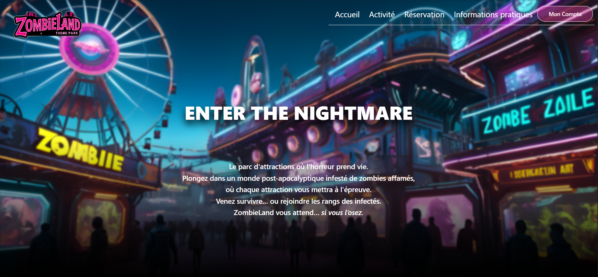
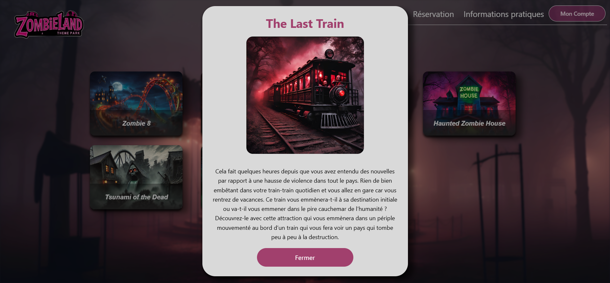
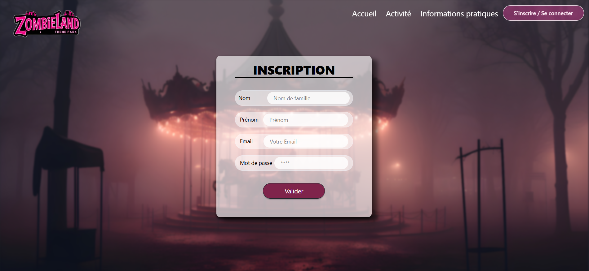

# Zombieland

## Présentation
Ce projet a été réalisé lors de la réalisation d'un projet en fin d'étude d'un DWWM. La durée de ce projet a été de 1 mois en collaboration avec 3 autres personnes.

Le but de ce projet a été de réaliser un site web basé sur un parc thème d'attraction dans le thème de l'horreur. Le site devait présenter les activités à effectuer et la réservation de billet

Si vous souhaitez voir le résultat du projet, rendez-vous [ici](http://zombielandworld.surge.sh/) (il est conseillé de consulter le site sur ordinateur)

## Fonctionnalités principales
- Création et gestion de compte utilisateur
- Connexion et inscription sécurisées
- Réservation d’activités et d’attractions
- Visualisation des activités disponibles
- Gestion des billets et des réservations
- Interface d’administration (gestion des utilisateurs, activités, etc.)

## Technologies utilisées
- Frontend : React, TypeScript, Vite, TailwindCSS, daisyUI
- Backend : Node.js, Express
- Base de données : PostgreSQL (via Sequelize)
- Autres : JWT, Insomnia, Vitest

## Démo

<figure style="text-align: center;">
  
  <figcaption>Page d'accueil</figcaption>
</figure>

<figure style="text-align: center;">
  
  <figcaption>Description d'une activité</figcaption>
</figure>

<figure style="text-align: center;">
  
  <figcaption>Formulaire d'inscription</figcaption>
</figure>

## Organisation du projet
 - `/src` : Frontend React (pages, composants, styles)
 - `/API` : Backend Node.js/Express (routes, contrôleurs, modèles)
 - `/public` : Fichiers statiques (images, assets)

## Contributeurs